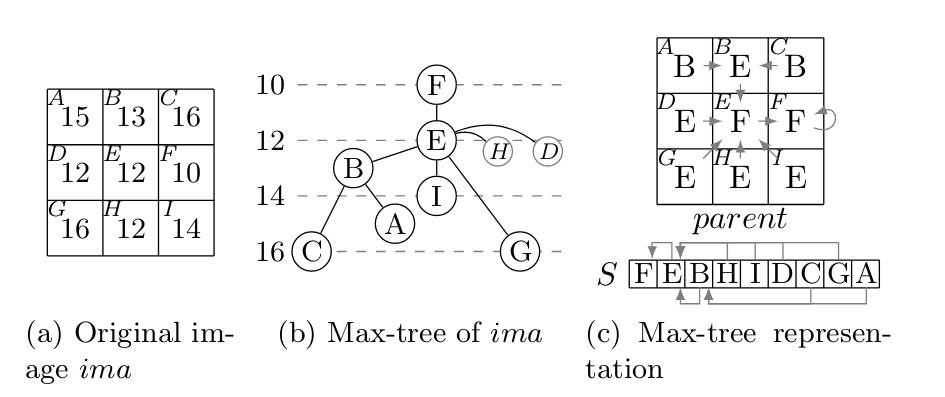

# MaMPy
Mathematical Morphology Python Library

## Structure du dépôt

* [MaMPyGUIDemoMaxTree.py](MaMPyGUIDemoMaxTree.py) : Demo Max-Tree avec filtre d'ouverture d'air.
* [maxtree.py](maxtree.py) : Implémentation Max-Tree et ouverture d'air.
* [maxtree_profile.py](maxtree_profile.py) : Analyse de performances et de résultats de maxtree.
* [maxtree_test.py](maxtree_test.py) : Tests utilisé pendant le développement.

* [doc](doc) : Dossier contenant la documentation et les articles utilisés pour le développement.
* [results](results) : Dossier contenant les résultats générer avec maxtree_profilel
* [examples/images](examples/images) : Dossier contenant les images d'entrée utilisé pour les tests et exemples.

## Résultats

[Les résultats sont disponibles dans le sous dossier correspondant.](results)

## Documentation Utilisateur

Avant de commencer, il est nécessaire d'installer les dépendances (voir requirements.txt). Il est fortement conseillé
d'utiliser en environnement python virtuel (venv par exemple).

* Lancer MaMPyGUIDemoMaxTree avec python3 :
```
python3 MaMPyGUIDemoMaxTree.py
```

* Lancer le profiler avec python3 :
```
python3 maxtree_profile.py examples/images/circuit_small.png 500
```
Le premier argument est le chemin de l'image, le second l'air minimum pour le filtrage d'air.


* Exemple d'utilisation de MaMPyGUIDemoMaxTree  
[](https://youtu.be/4NmaUEBlBkI)

## Documentation technique

* inputs
  * lecture d'image : utils.image_read

* maxtree : calcul du maxtree
  * (parent, s) = maxtree_union_find_level_compression(imageSrc, connection8=True)
    * arguments
      * imageSrc : l'image source sous forme d'array numpy 2D.
      * connection8 : booléen vrai pour 8 connexité, faux pour 4 connexité.
    * return
      * parent et s (voir documentation scientifique)

* maxtree : application du filtre d'ouverture d'aire
  * attributs = compute_attribute_area(s, parent, imageSrcFlat)
    * arguments :
      * s : crée par maxtree_union_find_level_compression.
      * parent : crée par maxtree_union_find_level_compression.
      * imageSrcFlat : l'image source sous forme d'array 1D.
    * return
      * attributs : les attributs d'aire
  * imageRes = direct_filter(s, parent, imageSrcFlat, attributs, threshold)
    * arguments :
      * s : crée par maxtree_union_find_level_compression.
      * parent : crée par maxtree_union_find_level_compression.
      * imageSrcFlat : l'image source sous forme d'array 1D.
      * attributs : les attributs d'aire
      * threshold : seuille pour le filtrage d'attributs
    * return
      * imageRes : l'image resultante sous forme d'array 1D

* outputs
  * imageRes.reshape(imageSrc.shape) pour récupérer un array numpy 2D de la bonne taille.
  * QPixmap(qimage2ndarray.array2qimage(imageRes)) pour mettre le résultat dans un QPixmap.
    * Le QPixmap peut ensuite être affiché dans un conteneur Qt, sauvegardé dans un fichier, transforme en QImage, etc.

## Documentation scientifique

### Maxtree avec Immersion Algorithms

Le *maxtree* ou l'arbre maximal est un arbre représentant la hiéarchie entre les composantes connexes d'une image. Il
peut être utilisé pour diverses opérations de filtrage comme l'ouverture d'aire ou le filtre de contraste.

Avant d'éxpliquer comment un arbre maximal est créé, il faut comprendre comment on le représente car la structure 
proposée dans l'article aide beaucoup à la création de celui-ci.

Le maxtree est représenté à l'aide d'un tableau (nommé *parent* dans l'article; de même dimension que l'image) qui 
donne pour chaque élement un lien vers son parent.
De plus, on a un autre tableau de dimension 1 (nommé *S*) qui contient les noeuds triés selon leur hauteur dans l'arbre. 
Celui-ci permet de facilement parcourir l'arbre.
Avec ces deux informations, on a une réprésentation complète de l'arbre maximal et on peut écrire des filtres.

Les algorithmes sont constitués de 2 étapes:
1. Triage des élements de l'image en entrée selon leurs valeurs
2. Fusion des élements selon leurs valeurs pour former l'arbre

Le tri des élements est trivial et nous permet d'obtenir directement *S*. On parcoure ensuite chaque élement de *S* en 
partant des feuilles et on définit l'élement courant comme le parent de ses voisins si ceux-ci sont des élements ayant
déjà étés traités.

Nous n'avons pas besoin de vérifier les valeurs des élements car on utilise *S* pour les parcourir et ils sont triés.
Contre-intuitivement, des élements étant dans la même composante (même valeure et même zone) ne sont pas dans le même noeud.
En effet, chaque élement est son propre noeud (ce sont des singletons). On utilise la notion de canonique pour savoir si un noeud donné fait parti 
d'une composante ou non. Un noeud est dit canonique si la valeure de son parent est différente de sa propre valeur.

Exemple avec une image tirée de l'article:


Ici, les noeuds **E, H et D** font parti de la même composante. C'est le même noeud mais la représentation choisie ne 
permet pas de combiner les noeuds directement. **E** est canonique alors que **H et D** ne le sont pas.

