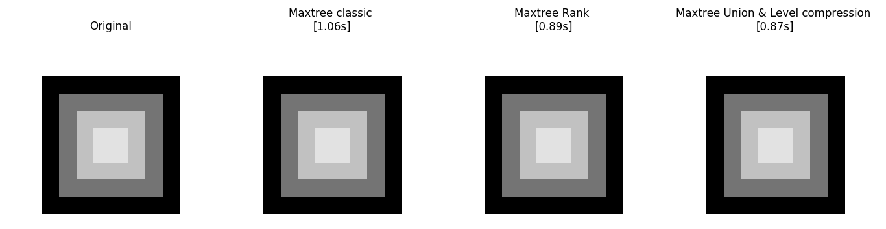
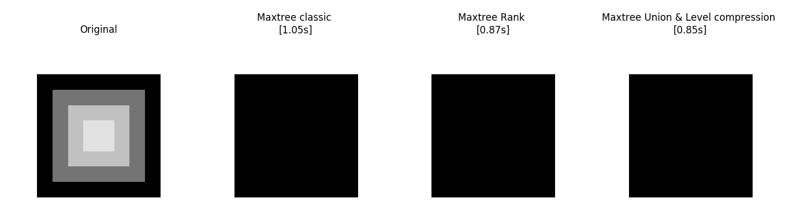

# MaMPy
Mathematical Morphology Python Library

## Résolutions des problèmes et test de l'algorithme

Afin de tester nos algorithmes, nous avons écris un filtre d'ouverture d'aire basé sur un maxtree.
Pour voir si notre ouverture d'air fonctionne correctement, nous avons fait une image synthétique simple contenant des
carrés de différentes tailles:

Voici le résultats que nous obtenons.

Avec une ouverture d'air de 50, rien est filtré puisque aucune composante a une aire < 50.

Avec une ouverture d'air de 1000.

Avec une ouverture d'air de 3000.

Avec une ouverture d'air de 6000.

