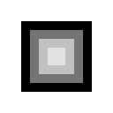
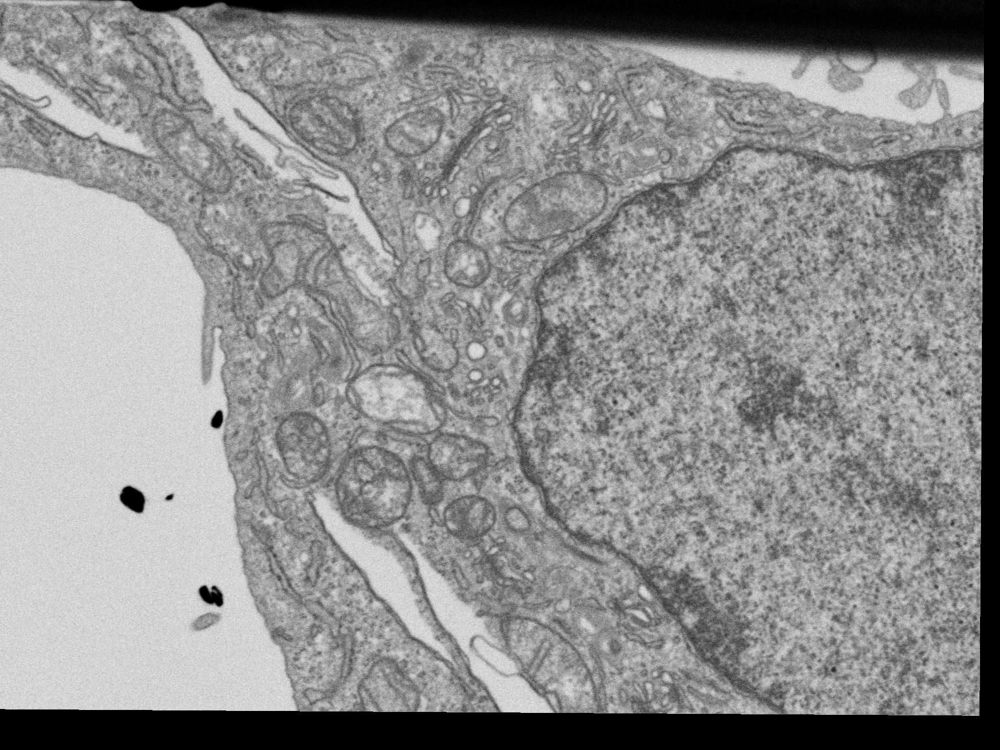
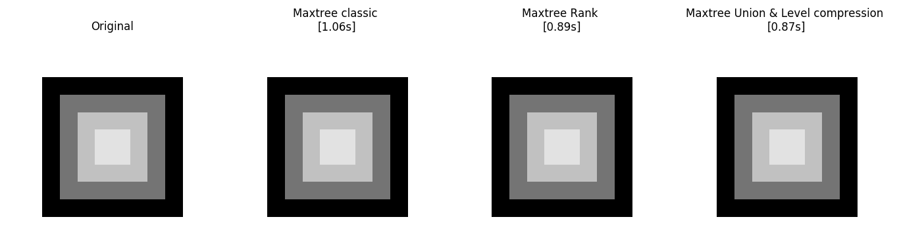
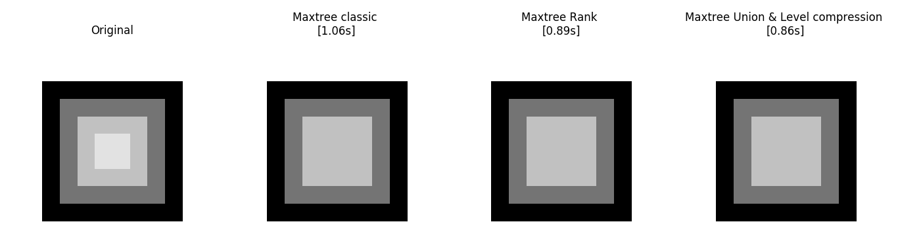
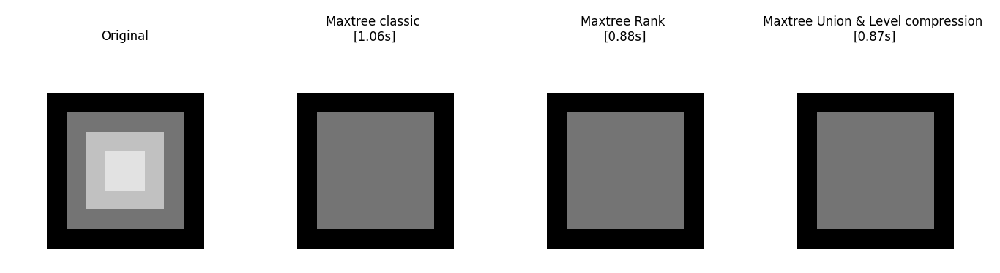
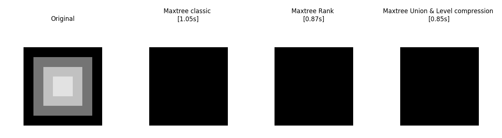
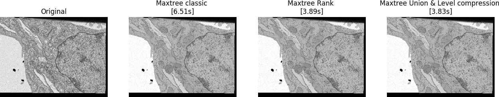

# Max Tree

Afin de tester nos algorithmes, nous avons écris un filtre d'ouverture d'aire basé sur un maxtree.
Pour voir si notre ouverture d'air fonctionne correctement, nous avons fait une image synthétique simple contenant des
carrés de différentes tailles :
  
Afin de tester les performances de nos algorithmes, nous avons essayé le filtre d'ouverture d'aire sur une image plus
grande : Noyau_Slice68 de taille 1536 x 2048.

Résultats :

Avec une ouverture d'air de 50, rien n'est filtré puisque aucune composante a une aire < 50.

Avec une ouverture d'air de 1000.

Avec une ouverture d'air de 3000.

Avec une ouverture d'air de 6000.

Noyau_Slice68 avec une ouverture d'air de 20000

